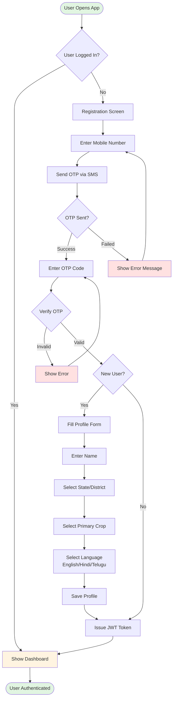
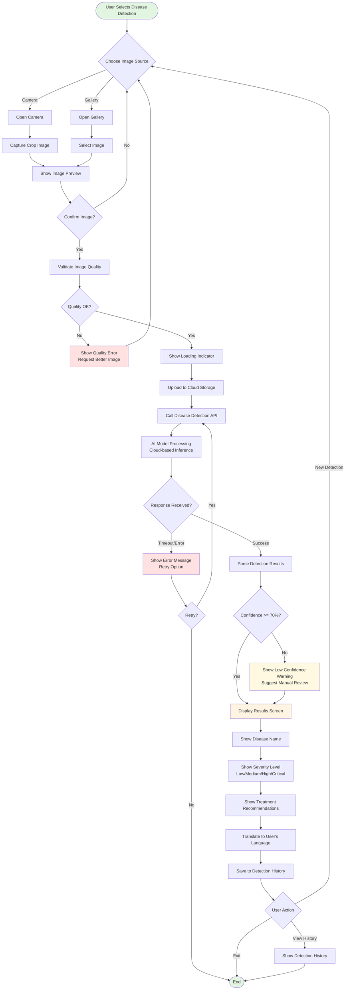
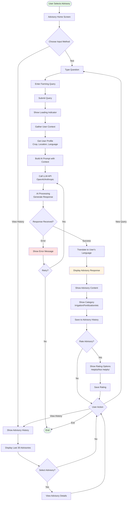
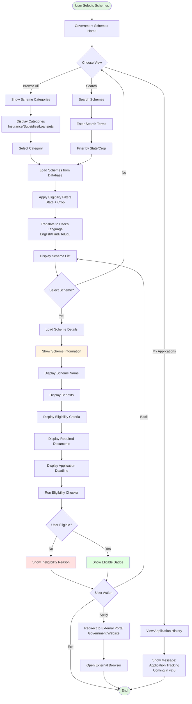
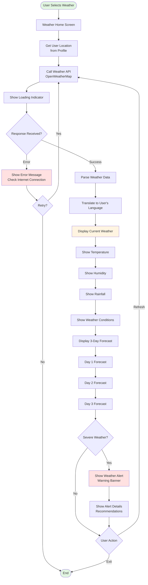
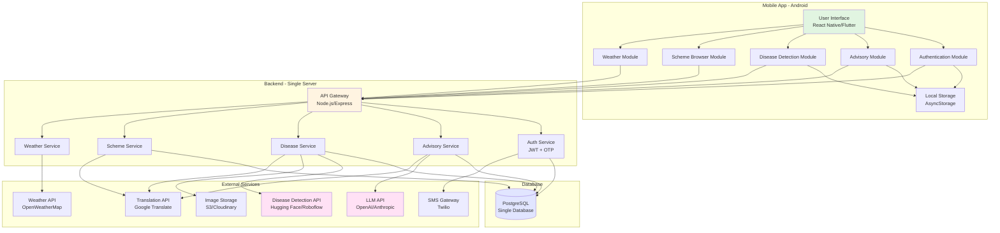
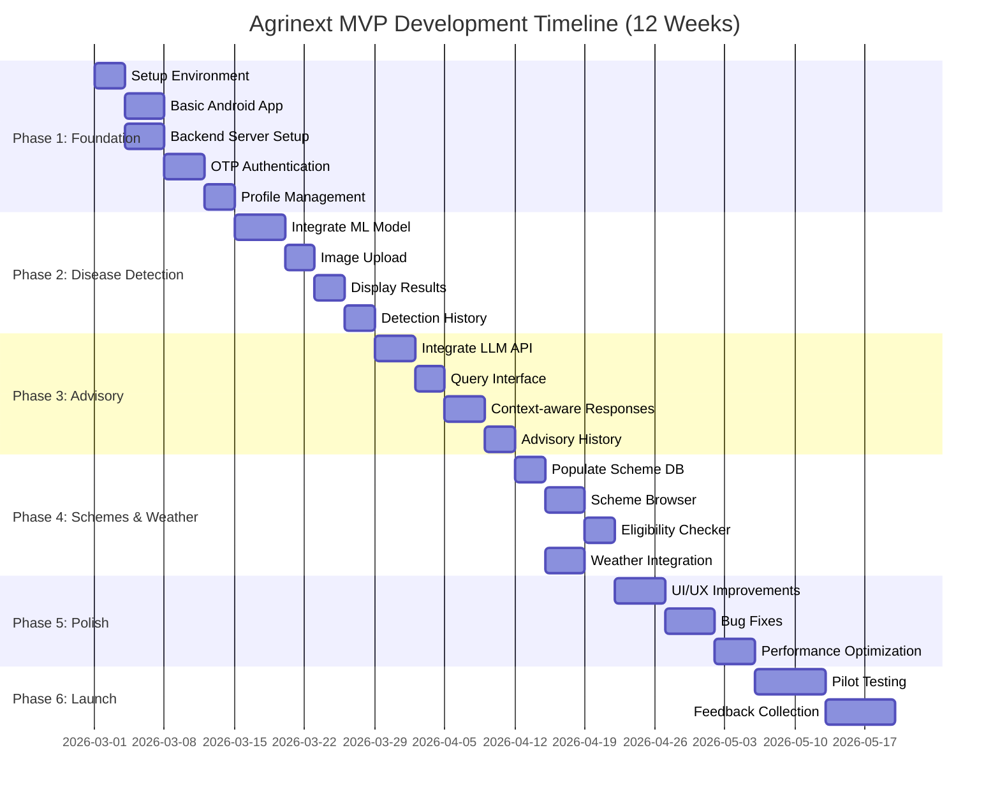
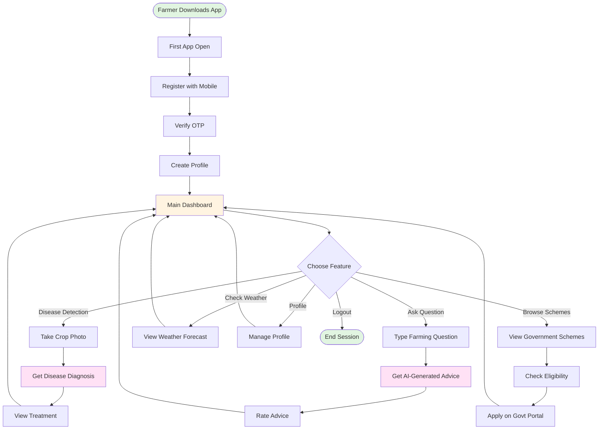
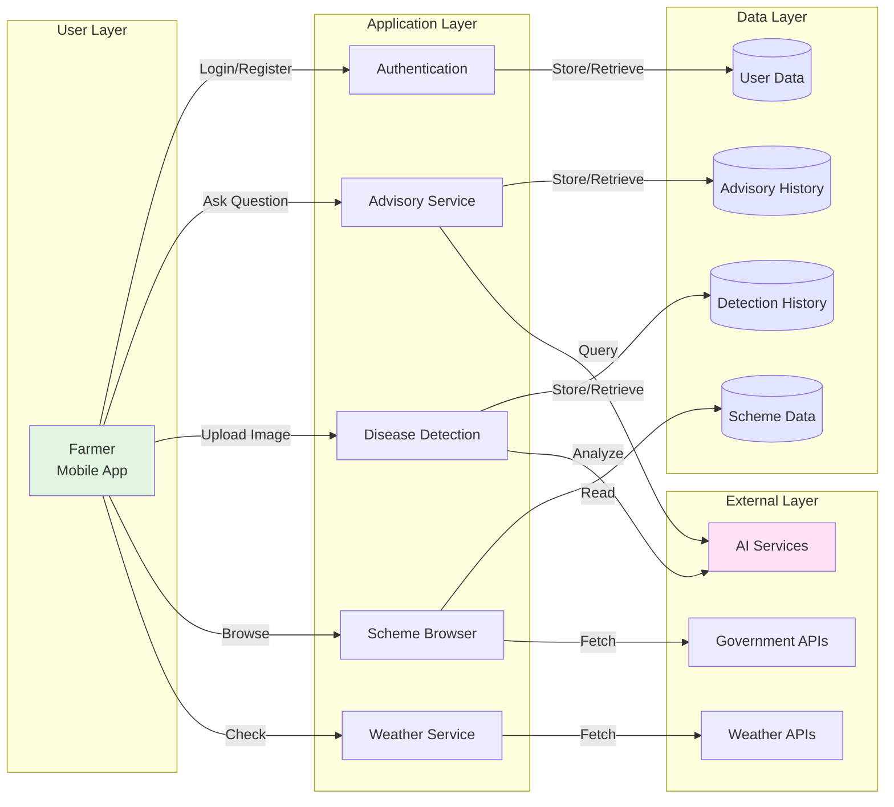

# Agrinext MVP - Flow Diagrams

## 1. User Registration & Authentication Flow

---

## 2. Disease Detection Flow

---

## 3. Agronomy Advisory Flow

---

## 4. Government Schemes Flow

---

## 5. Weather Information Flow

---

## 6. Overall MVP System Architecture Flow

---

## 7. MVP Development Phase Flow

---

## 8. User Journey - Complete Flow

---

## 9. Data Flow Diagram

---

## Summary

These flow diagrams cover:

1. **User Registration & Authentication** - Complete onboarding process
2. **Disease Detection** - Image capture to diagnosis flow
3. **Agronomy Advisory** - Query submission to response flow
4. **Government Schemes** - Browse, search, and eligibility checking
5. **Weather Information** - Weather data retrieval and display
6. **System Architecture** - Overall technical architecture
7. **Development Timeline** - 12-week Gantt chart
8. **User Journey** - Complete user experience flow
9. **Data Flow** - System data movement diagram

All diagrams are in Mermaid format and can be rendered in any Markdown viewer that supports Mermaid.
