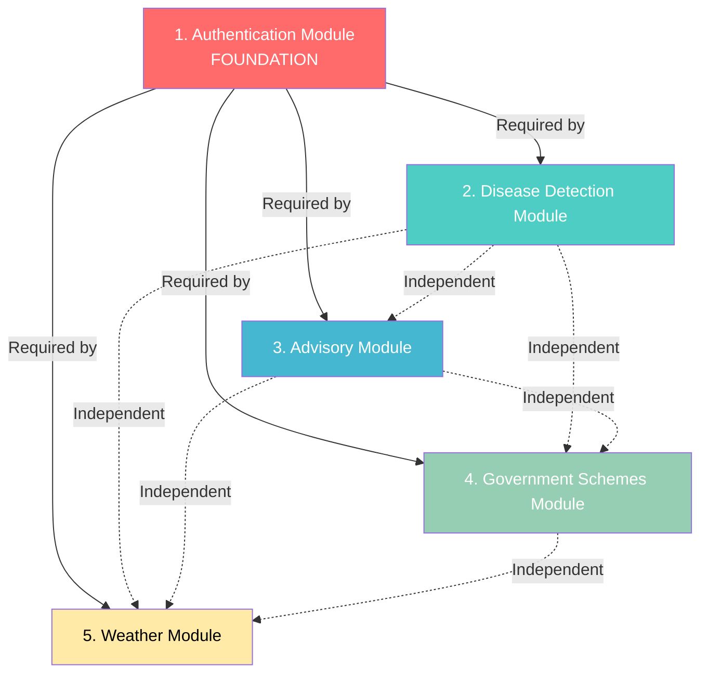

# Agrinext MVP - Module Dependencies & Implementation Order

## Module Dependency Analysis

Based on the flow diagrams, here's the dependency analysis for all 5 modules:

---

## Dependency Graph

**Legend:**
- Solid arrows (→) = Hard dependency (must be completed first)
- Dotted arrows (-.→) = Independent (can be developed in parallel)

---

## Module Priority & Implementation Order

### Priority 1: FOUNDATION (Week 1-2)
**Module: Authentication & User Management**

**Why First:**
- ALL other modules depend on user authentication
- Provides user context (location, crop, language) needed by other modules
- Establishes JWT token system for API security
- Creates user database schema foundation

**Dependencies:**
- None (foundation module)

**Blocks:**
- Disease Detection (needs user_id, language)
- Advisory (needs user profile for context)
- Schemes (needs user location, crop for filtering)
- Weather (needs user location)

**Implementation Tasks:**
1. Database setup (PostgreSQL)
2. User table schema
3. OTP service integration (Twilio)
4. JWT token generation/validation
5. Registration API endpoints
6. Login API endpoints
7. Profile management APIs
8. Mobile app authentication screens

**Deliverable:** Users can register, login, and manage profiles

---

### Priority 2: CORE VALUE PROPOSITIONS (Week 3-6)
**Modules: Disease Detection + Advisory (Parallel Development)**

These two modules can be developed in parallel after authentication is complete.

#### 2A. Disease Detection Module (Week 3-4)

**Why Second:**
- Primary value proposition for farmers
- Independent of other feature modules
- Only depends on Authentication

**Dependencies:**
- ✅ Authentication Module (for user_id, language)
- External: Image storage (S3/Cloudinary)
- External: Disease detection AI API

**Blocks:**
- None (independent module)

**Implementation Tasks:**
1. Image upload API
2. Image storage integration (S3/Cloudinary)
3. Disease detection AI integ