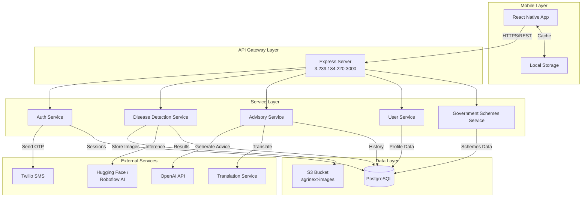

# Design Document: Phase 2 Development - Agrinext MVP

## Overview

Phase 2 delivers the core user-facing functionality of the Agrinext MVP by building a React Native mobile application integrated with backend services for authentication, AI-powered disease detection, and farming advisory. The system enables farmers to access agricultural expertise through their mobile devices in Hindi, English, or Telugu.

The architecture follows a three-tier pattern:
- **Presentation Layer**: React Native mobile app (iOS/Android)
- **Application Layer**: Node.js Express REST API services
- **Data Layer**: PostgreSQL database and AWS S3 storage

Key capabilities:
- OTP-based authentication with JWT token management
- AI-powered crop disease detection using image recognition
- OpenAI-powered farming advisory with contextual recommendations
- Multilingual support (Hindi, English, Telugu)
- Offline functionality for cached data access
- Government schemes browsing

## Architecture

### System Components



### Technology Stack

**Mobile Application**:
- React Native with TypeScript
- React Navigation for routing
- Axios for HTTP requests
- AsyncStorage for local persistence
- React Native Camera for image capture
- Secure storage (Keychain/Keystore) for tokens

**Backend Services**:
- Node.js 18 with Express
- JWT for authentication (jsonwebtoken library)
- Multer for file uploads
- AWS SDK for S3 operations
- PostgreSQL client (pg library)
- Connection pooling (10-50 connections)

**External Integrations**:
- Twilio API for SMS/OTP delivery
- Hugging Face API or Roboflow for disease detection
- OpenAI API (GPT-3.5/4) for advisory
- Google Translate API or multilingual prompts for translation

**Infrastructure**:
- Existing EC2 instance (3.239.184.220)
- Existing PostgreSQL database
- Existing S3 bucket (agrinext-images-1772367775698)

### Security Architecture

**Authentication Flow**:
1. User enters mobile number → OTP sent via Twilio
2. User enters OTP → Server verifies and issues JWT pair
3. Access token (1h expiry) for API requests
4. Refresh token (30d expiry) for token renewal
5. Tokens stored securely on device (Keychain/Keystore)

**Authorization**:
- JWT middleware validates all protected endpoints
- User ID extracted from token for resource access control
- Cross-user access prevented (403 Forbidden)

**Data Protection**:
- HTTPS for all API communication
- Refresh tokens hashed before database storage
- SQL injection prevention via parameterized queries
- CORS policies restricting to mobile app origin
- Rate limiting on all endpoints
- S3 bucket with private access (presigned URLs)

## Components and Interfaces

### Mobile Application Components

**Authentication Module**:
- `LoginScreen`: Mobile number input and OTP request
- `OTPVerificationScreen`: OTP code entry and verification
- `RegistrationScreen`: New user profile setup
- `AuthContext`: Global authentication state management
- `SecureStorage`: Token persistence wrapper

**Disease Detection Module**:
- `CameraScreen`: Crop image capture interface
- `ImagePickerScreen`: Gallery image selection
- `DetectionResultScreen`: Disease diagnosis display
- `DetectionHistoryScreen`: Past detections list
- `DetectionDetailScreen`: Individual detection view

**Advisory Module**:
- `AdvisoryScreen`: Question input interface
- `AdvisoryChatScreen`: Conversation-style Q&A display
- `AdvisoryHistoryScreen`: Past advisories list
- `RatingComponent`: Advisory feedback (1-5 stars)

**Government Schemes Module**:
- `SchemesListScreen`: Browsable schemes catalog
- `SchemeDetailScreen`: Individual scheme information
- `SchemeFilterComponent`: Category and keyword filtering

**Profile Module**:
- `ProfileScreen`: User information display and edit
- `LanguageSelector`: Language preference selection
- `ProfileEditScreen`: Profile update form

**Shared Components**:
- `OfflineIndicator`: Connectivity status banner
- `LoadingSpinner`: Request progress indicator
- `ErrorMessage`: Localized error display
- `LanguageProvider`: i18n context wrapper

### Backend Service Interfaces

**Authentication Service** (`/services/auth`):

```typescript
interface AuthService {
  sendOTP(mobileNumber: string): Promise<{ success: boolean; expiresAt: Date }>;
  verifyOTP(mobileNumber: string, code: string): Promise<{ accessToken: string; refreshToken: string; isNewUser: boolean }>;
  registerUser(userData: UserProfile): Promise<{ user: User; accessToken: string; refreshToken: string }>;
  refreshAccessToken(refreshToken: string): Promise<{ accessToken: string }>;
  logout(userId: string, tokenHash: string): Promise<void>;
  validateToken(token: string): Promise<{ userId: string; valid: boolean }>;
}

interface UserProfile {
  name: string;
  mobileNumber: string;
  location: string;
  primaryCrop: string;
  language: 'hi' | 'en' | 'te';
}
```

**Disease Detection Service** (`/services/disease-detection`):

```typescript
interface DiseaseDetectionService {
  detectDisease(imageFile: Buffer, userId: string, language: string): Promise<DetectionResult>;
  getDetectionHistory(userId: string, page: number, limit: number): Promise<PaginatedDetections>;
  getDetectionById(detectionId: string, userId: string): Promise<DetectionDetail>;
  uploadToS3(imageBuffer: Buffer, userId: string): Promise<{ imageUrl: string; key: string }>;
  generatePresignedUrl(key: string): Promise<string>;
}

interface DetectionResult {
  id: string;
  diseaseName: string;
  severity: 'low' | 'medium' | 'high';
  confidenceScore: number;
  recommendations: string[];
  imageUrl: string;
  detectedAt: Date;
}

interface DetectionDetail extends DetectionResult {
  imageMetadata: {
    size: number;
    format: string;
    dimensions: { width: number; height: number };
  };
}
```

**Advisory Service** (`/services/advisory`):

```typescript
interface AdvisoryService {
  generateAdvice(query: string, userId: string, language: string): Promise<AdvisoryResponse>;
  getAdvisoryHistory(userId: string, page: number, limit: number): Promise<PaginatedAdvisories>;
  rateAdvisory(advisoryId: string, userId: string, rating: number): Promise<void>;
  buildPromptContext(userId: string, query: string): Promise<string>;
}

interface AdvisoryResponse {
  id: string;
  query: string;
  response: string;
  language: string;
  createdAt: Date;
}
```

**User Service** (`/services/user`):

```typescript
interface UserService {
  getUserProfile(userId: string): Promise<UserProfile>;
  updateUserProfile(userId: string, updates: Partial<UserProfile>): Promise<UserProfile>;
  getUserPreferences(userId: string): Promise<{ language: string }>;
}
```

**Government Schemes Service** (`/services/schemes`):

```typescript
interface GovernmentSchemesService {
  getAllSchemes(language: string): Promise<Scheme[]>;
  getSchemeById(schemeId: string, language: string): Promise<SchemeDetail>;
  filterSchemes(category: string, keyword: string, language: string): Promise<Scheme[]>;
}

interface Scheme {
  id: string;
  name: string;
  description: string;
  category: 'subsidy' | 'loan' | 'insurance' | 'training';
}

interface SchemeDetail extends Scheme {
  eligibility: string;
  benefits: string;
  applicationProcess: string;
}
```

### API Endpoints

**Authentication Endpoints**:
- `POST /api/v1/auth/send-otp` - Request OTP for mobile number
- `POST /api/v1/auth/verify-otp` - Verify OTP and get tokens
- `POST /api/v1/auth/register` - Register new user profile
- `POST /api/v1/auth/refresh-token` - Refresh access token
- `POST /api/v1/auth/logout` - Invalidate user session

**Disease Detection Endpoints**:
- `POST /api/v1/diseases/detect` - Upload image and detect disease
- `GET /api/v1/diseases/history` - Get detection history (paginated)
- `GET /api/v1/diseases/:id` - Get specific detection details

**Advisory Endpoints**:
- `POST /api/v1/advisories/query` - Submit farming question
- `GET /api/v1/advisories/history` - Get advisory history (paginated)
- `PUT /api/v1/advisories/:id/rate` - Rate an advisory response

**User Endpoints**:
- `GET /api/v1/users/profile` - Get current user profile
- `PUT /api/v1/users/profile` - Update user profile

**Government Schemes Endpoints**:
- `GET /api/v1/schemes` - Get all schemes (with optional filters)
- `GET /api/v1/schemes/:id` - Get specific scheme details

**System Endpoints**:
- `GET /api/v1/health` - Health check endpoint

### Middleware Stack

**Request Processing Pipeline**:
1. `corsMiddleware` - CORS policy enforcement
2. `rateLimitMiddleware` - Request rate limiting
3. `requestLoggerMiddleware` - Request logging
4. `authMiddleware` - JWT validation (protected routes)
5. `errorHandlerMiddleware` - Centralized error handling
6. `responseTimeMiddleware` - Performance monitoring

## Data Models

### Database Schema (Existing from Phase 1)

**users table**:
```sql
CREATE TABLE users (
  id UUID PRIMARY KEY DEFAULT gen_random_uuid(),
  name VARCHAR(255) NOT NULL,
  mobile_number VARCHAR(15) UNIQUE NOT NULL,
  location VARCHAR(255),
  primary_crop VARCHAR(100),
  language VARCHAR(5) DEFAULT 'en',
  created_at TIMESTAMP DEFAULT CURRENT_TIMESTAMP,
  updated_at TIMESTAMP DEFAULT CURRENT_TIMESTAMP
);
```

**user_sessions table**:
```sql
CREATE TABLE user_sessions (
  id UUID PRIMARY KEY DEFAULT gen_random_uuid(),
  user_id UUID REFERENCES users(id) ON DELETE CASCADE,
  token_hash VARCHAR(255) NOT NULL,
  expires_at TIMESTAMP NOT NULL,
  created_at TIMESTAMP DEFAULT CURRENT_TIMESTAMP
);
```

**disease_detections table**:
```sql
CREATE TABLE disease_detections (
  id UUID PRIMARY KEY DEFAULT gen_random_uuid(),
  user_id UUID REFERENCES users(id) ON DELETE CASCADE,
  image_url TEXT NOT NULL,
  image_key VARCHAR(500) NOT NULL,
  disease_name VARCHAR(255),
  severity VARCHAR(50),
  confidence_score DECIMAL(5,2),
  recommendations TEXT,
  image_size INTEGER,
  image_format VARCHAR(10),
  image_width INTEGER,
  image_height INTEGER,
  created_at TIMESTAMP DEFAULT CURRENT_TIMESTAMP
);
```

**advisories table**:
```sql
CREATE TABLE advisories (
  id UUID PRIMARY KEY DEFAULT gen_random_uuid(),
  user_id UUID REFERENCES users(id) ON DELETE CASCADE,
  query_text TEXT NOT NULL,
  response_text TEXT NOT NULL,
  language VARCHAR(5) NOT NULL,
  rating INTEGER CHECK (rating >= 1 AND rating <= 5),
  created_at TIMESTAMP DEFAULT CURRENT_TIMESTAMP
);
```

**government_schemes table**:
```sql
CREATE TABLE government_schemes (
  id UUID PRIMARY KEY DEFAULT gen_random_uuid(),
  name VARCHAR(255) NOT NULL,
  description TEXT,
  category VARCHAR(50),
  eligibility TEXT,
  benefits TEXT,
  application_process TEXT,
  is_active BOOLEAN DEFAULT true,
  created_at TIMESTAMP DEFAULT CURRENT_TIMESTAMP
);
```

**audit_logs table**:
```sql
CREATE TABLE audit_logs (
  id UUID PRIMARY KEY DEFAULT gen_random_uuid(),
  user_id UUID REFERENCES users(id) ON DELETE SET NULL,
  action VARCHAR(100) NOT NULL,
  endpoint VARCHAR(255),
  method VARCHAR(10),
  status_code INTEGER,
  error_message TEXT,
  response_time_ms INTEGER,
  ip_address VARCHAR(45),
  created_at TIMESTAMP DEFAULT CURRENT_TIMESTAMP
);
```

### Mobile App Data Models

**Local Storage Schema**:

```typescript
interface LocalUserProfile {
  id: string;
  name: string;
  mobileNumber: string;
  location: string;
  primaryCrop: string;
  language: 'hi' | 'en' | 'te';
  lastSynced: Date;
}

interface CachedDetection {
  id: string;
  diseaseName: string;
  severity: string;
  confidenceScore: number;
  recommendations: string[];
  imageUrl: string;
  detectedAt: Date;
  synced: boolean;
}

interface CachedAdvisory {
  id: string;
  query: string;
  response: string;
  language: string;
  rating?: number;
  createdAt: Date;
  synced: boolean;
}

interface CachedScheme {
  id: string;
  name: string;
  description: string;
  category: string;
  eligibility: string;
  benefits: string;
  applicationProcess: string;
}

interface PendingRequest {
  id: string;
  type: 'detection' | 'advisory';
  payload: any;
  createdAt: Date;
  retryCount: number;
}
```

### API Request/Response Models

**Authentication**:

```typescript
// POST /api/v1/auth/send-otp
interface SendOTPRequest {
  mobileNumber: string; // 10 digits
}

interface SendOTPResponse {
  success: boolean;
  message: string;
  expiresAt: string; // ISO timestamp
}

// POST /api/v1/auth/verify-otp
interface VerifyOTPRequest {
  mobileNumber: string;
  code: string; // 6 digits
}

interface VerifyOTPResponse {
  accessToken: string;
  refreshToken: string;
  isNewUser: boolean;
  user?: UserProfile; // Only if existing user
}

// POST /api/v1/auth/register
interface RegisterRequest {
  name: string;
  location: string;
  primaryCrop: string;
  language: 'hi' | 'en' | 'te';
}

interface RegisterResponse {
  user: UserProfile;
  accessToken: string;
  refreshToken: string;
}
```

**Disease Detection**:

```typescript
// POST /api/v1/diseases/detect
interface DetectDiseaseRequest {
  image: File; // multipart/form-data
  // JWT in Authorization header
}

interface DetectDiseaseResponse {
  id: string;
  diseaseName: string;
  severity: 'low' | 'medium' | 'high';
  confidenceScore: number;
  recommendations: string[];
  imageUrl: string; // Presigned URL
  detectedAt: string;
}

// GET /api/v1/diseases/history?page=1&limit=20
interface DetectionHistoryResponse {
  detections: DetectionResult[];
  pagination: {
    page: number;
    limit: number;
    total: number;
    totalPages: number;
  };
}
```

**Advisory**:

```typescript
// POST /api/v1/advisories/query
interface AdvisoryQueryRequest {
  query: string; // Max 500 chars
}

interface AdvisoryQueryResponse {
  id: string;
  query: string;
  response: string;
  language: string;
  createdAt: string;
}

// PUT /api/v1/advisories/:id/rate
interface RateAdvisoryRequest {
  rating: number; // 1-5
}

interface RateAdvisoryResponse {
  success: boolean;
  message: string;
}
```


### Error Response Model

```typescript
interface ErrorResponse {
  error: {
    code: string; // e.g., "INVALID_OTP", "RATE_LIMIT_EXCEEDED"
    message: string; // User-friendly, localized message
    details?: any; // Optional additional context
    retryAfter?: number; // Seconds until retry allowed (for rate limits)
  };
}
```

## Error Handling

### Error Categories and Handling Strategy

**Client Errors (4xx)**:
- `400 Bad Request`: Invalid input validation
  - Missing required fields
  - Invalid format (mobile number, OTP, rating)
  - File size/format violations
  - Query length violations
- `401 Unauthorized`: Authentication failures
  - Invalid/expired JWT token
  - Invalid/expired OTP
  - Invalid refresh token
- `403 Forbidden`: Authorization failures
  - Cross-user resource access attempts
- `404 Not Found`: Resource not found
  - Non-existent detection/advisory ID
- `429 Too Many Requests`: Rate limit exceeded
  - OTP request limit (3/hour)
  - API endpoint rate limits

**Server Errors (5xx)**:
- `500 Internal Server Error`: Unexpected server failures
  - Database connection errors
  - Unhandled exceptions
- `503 Service Unavailable`: External service failures
  - Twilio API failures
  - OpenAI API failures
  - Hugging Face/Roboflow failures
  - S3 upload failures

### Error Handling Implementation

**Backend Error Handling**:

```typescript
class AppError extends Error {
  constructor(
    public statusCode: number,
    public code: string,
    public message: string,
    public details?: any
  ) {
    super(message);
  }
}

// Centralized error handler middleware
function errorHandler(err: Error, req: Request, res: Response, next: NextFunction) {
  // Log error with context
  logger.error({
    error: err.message,
    stack: err.stack,
    userId: req.user?.id,
    endpoint: req.path,
    method: req.method,
  });
  
  // Log to audit_logs table
  auditLogger.logError({
    userId: req.user?.id,
    endpoint: req.path,
    method: req.method,
    errorMessage: err.message,
    ipAddress: req.ip,
  });
  
  if (err instanceof AppError) {
    return res.status(err.statusCode).json({
      error: {
        code: err.code,
        message: translateError(err.message, req.user?.language || 'en'),
        details: err.details,
      },
    });
  }
  
  // Unknown errors - don't expose internals
  return res.status(500).json({
    error: {
      code: 'INTERNAL_ERROR',
      message: translateError('An unexpected error occurred', req.user?.language || 'en'),
    },
  });
}
```

**External Service Error Handling**:

```typescript
// Twilio OTP sending with retry
async function sendOTPWithRetry(mobileNumber: string, code: string): Promise<void> {
  const maxRetries = 3;
  let lastError: Error;
  
  for (let attempt = 1; attempt <= maxRetries; attempt++) {
    try {
      await twilioClient.messages.create({
        body: `Your Agrinext OTP is: ${code}. Valid for 10 minutes.`,
        to: mobileNumber,
        from: process.env.TWILIO_PHONE_NUMBER,
      });
      return;
    } catch (error) {
      lastError = error;
      logger.warn(`Twilio attempt ${attempt} failed:`, error);
      if (attempt < maxRetries) {
        await sleep(1000 * attempt); // Exponential backoff
      }
    }
  }
  
  throw new AppError(503, 'SMS_SERVICE_UNAVAILABLE', 'Unable to send OTP. Please try again later.');
}

// OpenAI API with timeout and fallback
async function generateAdviceWithFallback(prompt: string, language: string): Promise<string> {
  try {
    const response = await Promise.race([
      openai.chat.completions.create({
        model: 'gpt-3.5-turbo',
        messages: [{ role: 'user', content: prompt }],
        max_tokens: 500,
      }),
      new Promise((_, reject) => 
        setTimeout(() => reject(new Error('Timeout')), 5000)
      ),
    ]);
    
    return response.choices[0].message.content;
  } catch (error) {
    logger.error('OpenAI API failed:', error);
    
    if (error.message === 'Timeout') {
      throw new AppError(504, 'ADVISORY_TIMEOUT', 'Request timed out. Please try again.');
    }
    
    if (error.status === 429) {
      throw new AppError(429, 'ADVISORY_RATE_LIMIT', 'Service is busy. Please try again in a moment.');
    }
    
    throw new AppError(503, 'ADVISORY_UNAVAILABLE', 'Advisory service is temporarily unavailable.');
  }
}

// AI Model inference with fallback
async function detectDiseaseWithFallback(imageBuffer: Buffer): Promise<AIModelResponse> {
  try {
    // Try primary model (Hugging Face)
    return await huggingFaceInference(imageBuffer);
  } catch (primaryError) {
    logger.warn('Primary AI model failed, trying fallback:', primaryError);
    
    try {
      // Fallback to Roboflow
      return await roboflowInference(imageBuffer);
    } catch (fallbackError) {
      logger.error('Both AI models failed:', { primaryError, fallbackError });
      throw new AppError(503, 'DETECTION_UNAVAILABLE', 'Disease detection service is temporarily unavailable.');
    }
  }
}
```

**Mobile App Error Handling**:

```typescript
// API client with error handling
class APIClient {
  async request<T>(config: AxiosRequestConfig): Promise<T> {
    try {
      const response = await axios(config);
      return response.data;
    } catch (error) {
      if (error.response) {
        // Server responded with error
        const errorData = error.response.data.error;
        throw new APIError(
          error.response.status,
          errorData.code,
          errorData.message,
          errorData.details
        );
      } else if (error.request) {
        // No response received (network error)
        throw new NetworkError('No internet connection. Please check your network.');
      } else {
        // Request setup error
        throw new Error('An unexpected error occurred.');
      }
    }
  }
}

// Error display component
function ErrorMessage({ error, onRetry }: { error: APIError; onRetry?: () => void }) {
  const { t } = useTranslation();
  
  return (
    <View style={styles.errorContainer}>
      <Text style={styles.errorMessage}>{error.message}</Text>
      {onRetry && (
        <Button title={t('retry')} onPress={onRetry} />
      )}
      {error.retryAfter && (
        <Text style={styles.retryInfo}>
          {t('retryAfter', { seconds: error.retryAfter })}
        </Text>
      )}
    </View>
  );
}
```

### Logging Strategy

**Structured Logging Levels**:
- `ERROR`: System failures, external service failures, unhandled exceptions
- `WARN`: Retry attempts, degraded performance, rate limit approaches
- `INFO`: API requests, authentication events, business events
- `DEBUG`: Detailed execution flow (development only)

**Audit Logging**:
All significant events logged to `audit_logs` table:
- Authentication events (login, logout, token refresh)
- Authorization failures (cross-user access attempts)
- API requests with response times
- External service failures
- Security events (invalid tokens, rate limit violations)
- User actions (detection requests, advisory queries, scheme views)

**Performance Monitoring**:
- Response time tracking for all endpoints
- Threshold alerts (>30s for detection, >5s for advisory)
- Database query performance logging
- External API latency tracking

## Testing Strategy

### Testing Approach

Phase 2 requires a dual testing approach combining unit tests for specific scenarios and property-based tests for comprehensive validation across all inputs.

**Unit Testing**:
- Specific examples demonstrating correct behavior
- Edge cases (empty inputs, boundary values, special characters)
- Error conditions (invalid tokens, expired OTPs, service failures)
- Integration points between components
- Mock external services (Twilio, OpenAI, AI models)

**Property-Based Testing**:
- Universal properties that hold for all valid inputs
- Comprehensive input coverage through randomization
- Minimum 100 iterations per property test
- Each test references design document property
- Tag format: `Feature: phase-2-development, Property {number}: {property_text}`

### Testing Tools and Configuration

**Backend Testing**:
- Framework: Jest with TypeScript
- Property-based testing: fast-check library
- Mocking: jest.mock for external services
- Database: In-memory PostgreSQL or test database
- Coverage target: 80% code coverage

**Mobile App Testing**:
- Framework: Jest with React Native Testing Library
- Property-based testing: fast-check library
- Component testing: @testing-library/react-native
- E2E testing: Detox (optional for MVP)
- Coverage target: 70% code coverage

**Property Test Configuration**:
```typescript
import fc from 'fast-check';

describe('Feature: phase-2-development', () => {
  it('Property 1: ...', () => {
    fc.assert(
      fc.property(
        fc.string(), // Arbitrary generators
        (input) => {
          // Test property holds for all inputs
          expect(/* assertion */).toBe(true);
        }
      ),
      { numRuns: 100 } // Minimum 100 iterations
    );
  });
});
```

### Test Categories

**Authentication Tests**:
- Unit: Valid OTP verification, expired OTP rejection, token refresh flow
- Property: Token generation produces valid JWT for all user data
- Integration: End-to-end registration and login flow

**Disease Detection Tests**:
- Unit: Valid image upload, oversized image rejection, unsupported format rejection
- Property: Image upload and retrieval round-trip preserves data
- Integration: Full detection flow with mocked AI model

**Advisory Tests**:
- Unit: Valid query processing, empty query rejection, query length validation
- Property: Advisory responses contain user context for all queries
- Integration: Full advisory flow with mocked OpenAI API

**Multilingual Tests**:
- Unit: Language selection persistence, UI text translation
- Property: All translatable content has translations for all supported languages
- Integration: Language switching updates all UI elements

**Offline Tests**:
- Unit: Cache storage and retrieval, sync queue management
- Property: Cached data retrieval returns same data as original API response
- Integration: Offline mode with queued requests syncing on reconnection


## Correctness Properties

A property is a characteristic or behavior that should hold true across all valid executions of a system-essentially, a formal statement about what the system should do. Properties serve as the bridge between human-readable specifications and machine-verifiable correctness guarantees.

### Property Reflection

After analyzing all acceptance criteria, I identified potential redundancies:

- Properties about "storing data with all required fields" (1.7, 3.8, 5.6, 7.10) can be consolidated into fewer, more comprehensive properties
- Properties about "logging all events" (1.10, 4.10, 6.8, 11.7, 13.1, 13.7) can be combined into a single comprehensive audit logging property
- Properties about "translation to user's preferred language" (3.7, 9.3, 9.4, 9.5, 9.6, 13.4, 14.3) can be consolidated
- Properties about "round-trip caching" (8.1, 8.2, 8.3, 8.4, 14.6) can be combined
- Properties about "authorization blocking cross-user access" (4.7, 6.7) can be combined
- Properties about "token validation and rejection" (7.4, 7.8, 11.1) can be consolidated

The following properties represent the unique, non-redundant validation requirements:

### Property 1: OTP Rate Limiting Enforcement

For any mobile number and sequence of OTP requests with timestamps, when more than 3 requests are made within a 1-hour window, the 4th and subsequent requests should be rejected until the window expires.

**Validates: Requirements 1.2**

### Property 2: Valid OTP Verification Within Time Window

For any valid OTP code generated for a mobile number, when verified within 10 minutes of generation, the system should issue a JWT token pair (access token and refresh token).

**Validates: Requirements 1.4**

### Property 3: Token Expiration Times

For any user authentication, the issued access token should have exactly 1-hour expiration and the refresh token should have exactly 30-day expiration from the time of issuance.

**Validates: Requirements 1.5**

### Property 4: User Registration Data Persistence

For any valid user profile data (name, location, primary crop, language), when submitted during registration, a corresponding user record should be created in the database with all provided fields.

**Validates: Requirements 1.7**

### Property 5: Token Refresh Round-Trip

For any valid refresh token with an expired access token, when the refresh token is submitted, a new valid access token should be issued while the refresh token remains valid.

**Validates: Requirements 1.8**

### Property 6: Session Invalidation on Logout

For any active user session, when logout is performed, the session's tokens should be invalidated in the user_sessions table and subsequent requests with those tokens should be rejected.

**Validates: Requirements 1.9**

### Property 7: Language Selection Persistence

For any language selection (Hindi, English, or Telugu), when a user selects a language, it should be stored in Local_Storage and retrieved correctly on subsequent app launches.

**Validates: Requirements 2.9**

### Property 8: UI Text Translation Completeness

For any supported language (Hindi, English, Telugu), all static UI text elements should have translations available and display in the selected language.

**Validates: Requirements 2.8, 9.2**

### Property 9: Image Upload with Unique Identifiers

For any uploaded crop image, the system should store it in S3 with a unique UUID-based filename, ensuring no two images have the same identifier.

**Validates: Requirements 3.2, 10.1**

### Property 10: Detection Result Completeness

For any disease detection operation, the returned result should contain all required fields: disease name, severity level, confidence score, treatment recommendations, and image URL.

**Validates: Requirements 3.6**

### Property 11: Detection History Ordering

For any user's detection history, when retrieved, all detections should be ordered by timestamp in descending order (most recent first).

**Validates: Requirements 3.9**

### Property 12: Detection Data Round-Trip

For any disease detection result stored in the database, when retrieved by ID, the complete detection record should match the originally stored data including all metadata fields.

**Validates: Requirements 3.10**

### Property 13: Cross-User Authorization Enforcement

For any two distinct users A and B, when user A attempts to access user B's resources (detections, advisories, profile), the system should return HTTP 403 Forbidden.

**Validates: Requirements 4.7, 6.7**

### Property 14: Unauthenticated Request Rejection

For any protected API endpoint, when a request is made without a valid JWT token, the system should return HTTP 401 Unauthorized.

**Validates: Requirements 4.2**

### Property 15: Advisory Context Inclusion

For any farming advisory query, the prompt sent to OpenAI API should include the user's profile data (location, primary crop, language) and current seasonal/regional context.

**Validates: Requirements 5.1, 5.2, 5.3**

### Property 16: Advisory History Ordering

For any user's advisory history, when retrieved, all advisories should be ordered by timestamp in descending order (most recent first).

**Validates: Requirements 5.8**

### Property 17: Advisory Rating Round-Trip

For any advisory, when a user submits a rating (1-5), the rating should be stored in the advisories table and retrievable with the advisory record.

**Validates: Requirements 5.9**

### Property 18: Invalid Rating Rejection

For any rating value outside the range 1-5, when submitted for an advisory, the system should return HTTP 400 Bad Request.

**Validates: Requirements 6.6**

### Property 19: Invalid Mobile Number Rejection

For any mobile number that is not exactly 10 digits, when submitted for OTP request, the system should return HTTP 400 Bad Request.

**Validates: Requirements 7.2**

### Property 20: Token Validation Enforcement

For any JWT token (access or refresh), the system should validate both the signature and expiration before accepting it, rejecting invalid or expired tokens with HTTP 401 Unauthorized.

**Validates: Requirements 7.4, 7.8, 11.1**

### Property 21: Required Profile Fields Validation

For any user registration or profile update, when required fields (name, location, primary crop, language) are missing, the system should return HTTP 400 Bad Request with details about which fields are missing.

**Validates: Requirements 7.6**

### Property 22: Session Storage with Token Hashing

For any user session created during authentication, the refresh token should be hashed before storage in the user_sessions table, and the stored hash should never match the original token.

**Validates: Requirements 7.10, 11.3**

### Property 23: Offline Data Caching Round-Trip

For any data fetched from the backend (user profile, detection history, advisory history, government schemes), when stored in Local_Storage for offline access, the cached data should match the original API response when retrieved.

**Validates: Requirements 8.1, 8.2, 8.3, 8.4, 14.6**

### Property 24: Offline Request Queuing

For any API request made while offline (detection, advisory), the request should be queued in Local_Storage and automatically sent to the backend when connectivity is restored.

**Validates: Requirements 8.9, 8.10**

### Property 25: Content Translation to User Language

For any content returned by the backend (disease detection results, advisory responses, government schemes, error messages), the content should be translated to match the user's preferred language stored in their profile.

**Validates: Requirements 3.7, 5.5, 9.3, 9.4, 9.5, 9.6, 13.4, 14.3**

### Property 26: Language Preference Persistence

For any user's language preference, when stored in the database users table, it should be retrievable and used for all subsequent API responses for that user.

**Validates: Requirements 9.8, 9.9**

### Property 27: Dynamic Language Switching

For any language change in the mobile app, all UI text should immediately update to the new language without requiring an app restart.

**Validates: Requirements 9.10, 15.10**

### Property 28: Image Storage Folder Structure

For any uploaded image, the S3 storage path should follow the structure {year}/{month}/{user_id}/{filename}, where year and month are derived from the upload timestamp.

**Validates: Requirements 10.2**

### Property 29: Image Compression Before Upload

For any image larger than 2MB, the system should compress it to a maximum of 2MB before uploading to S3, while maintaining acceptable quality.

**Validates: Requirements 10.3**

### Property 30: Presigned URL Generation with Expiration

For any image stored in S3, when a presigned URL is generated for access, the URL should have exactly 1-hour expiration from generation time.

**Validates: Requirements 10.4, 10.5**

### Property 31: Image Format Validation

For any uploaded image, the system should validate that the format is one of JPEG, PNG, or HEIC, rejecting all other formats with HTTP 400 Bad Request.

**Validates: Requirements 10.7**

### Property 32: Image Metadata Storage

For any uploaded image, the system should store metadata (file size, format, dimensions) in the disease_detections table alongside the detection results.

**Validates: Requirements 10.9**

### Property 33: SQL Injection Prevention

For any user input used in database queries, the system should sanitize the input to prevent SQL injection attacks, ensuring malicious SQL patterns are neutralized.

**Validates: Requirements 11.5**

### Property 34: Comprehensive Audit Logging

For any significant system event (authentication, API requests, security events, errors, user actions), the system should log the event to the audit_logs table with timestamp, user_id, action type, and relevant details.

**Validates: Requirements 1.10, 4.10, 6.8, 11.7, 12.7, 13.1, 13.7, 14.7, 15.8**

### Property 35: API Rate Limiting Enforcement

For any API endpoint, when requests from a single user exceed the configured rate limit, subsequent requests should be rejected with HTTP 429 Too Many Requests until the rate limit window resets.

**Validates: Requirements 11.9**

### Property 36: Error Message Safety

For any error response returned to clients, the error message should be user-friendly and should not expose internal system details (stack traces, database schemas, internal paths).

**Validates: Requirements 13.2**

### Property 37: Government Scheme Display Completeness

For any government scheme displayed in the mobile app, all required fields (name, description, eligibility, benefits, application process) should be present and visible.

**Validates: Requirements 14.2**

### Property 38: Scheme Filtering by Category

For any category filter (subsidy, loan, insurance, training) applied to government schemes, all returned schemes should belong to the selected category.

**Validates: Requirements 14.4**

### Property 39: Scheme Keyword Search

For any keyword search query on government schemes, all returned schemes should contain the keyword in at least one of their text fields (name, description, eligibility, benefits).

**Validates: Requirements 14.5**

### Property 40: Profile Update Immutability of Mobile Number

For any profile update request, the mobile number field should be immutable (read-only), and attempts to change it should either be ignored or rejected.

**Validates: Requirements 15.2**

### Property 41: Profile Update Round-Trip

For any profile update (name, location, primary crop, language), when successfully updated, the backend should return the updated profile data, and this data should match what is subsequently retrieved from the database.

**Validates: Requirements 15.3, 15.6**

### Property 42: Profile Cache Synchronization

For any successful profile update, the mobile app should update the cached profile data in Local_Storage to match the server response, ensuring offline data stays synchronized.

**Validates: Requirements 15.7**

### Property 43: Profile Data Validation

For any profile update request, the backend should validate all fields (name non-empty, location valid, primary crop from supported list, language one of hi/en/te) before updating the database.

**Validates: Requirements 15.5**


## Implementation Notes

### Development Phases

**Phase 2.1: Authentication Foundation (Week 3)**
- Implement OTP service with Twilio integration
- Build JWT token generation and validation
- Create authentication API endpoints
- Implement rate limiting middleware
- Set up audit logging infrastructure

**Phase 2.2: Mobile App Shell (Week 3-4)**
- Set up React Native project with TypeScript
- Implement navigation structure
- Create authentication screens (login, OTP, registration)
- Implement secure token storage
- Set up i18n for multilingual support

**Phase 2.3: Disease Detection (Week 4)**
- Integrate Hugging Face or Roboflow AI model
- Implement image upload to S3 with compression
- Build disease detection API endpoints
- Create camera and detection UI in mobile app
- Implement detection history with presigned URLs

**Phase 2.4: Farming Advisory (Week 5)**
- Integrate OpenAI API with context-aware prompts
- Implement translation service
- Build advisory API endpoints
- Create advisory chat UI in mobile app
- Implement advisory history and rating

**Phase 2.5: Supporting Features (Week 5-6)**
- Implement government schemes API and UI
- Build user profile management
- Implement offline functionality with caching
- Add comprehensive error handling
- Performance optimization and testing

**Phase 2.6: Testing and Deployment (Week 6)**
- Write unit tests for all services
- Implement property-based tests for all 43 properties
- Integration testing
- User acceptance testing
- Production deployment

### Key Technical Decisions

**AI Model Selection**:
- Primary: Hugging Face Inference API (plant-disease-detection models)
- Fallback: Roboflow (custom trained model)
- Rationale: Hugging Face offers pre-trained models with good accuracy, Roboflow provides fallback and customization options

**Translation Strategy**:
- Use multilingual prompts for OpenAI (include "respond in Hindi/Telugu" in prompt)
- Google Translate API for disease detection results and UI content
- Rationale: Reduces API costs while maintaining quality for advisory responses

**Offline Strategy**:
- AsyncStorage for simple key-value data (tokens, preferences)
- SQLite for structured offline data (detection/advisory history)
- Request queue with exponential backoff for sync
- Rationale: Balances simplicity with robust offline capabilities

**Image Handling**:
- React Native Image Picker for capture/selection
- Client-side compression using react-native-image-resizer
- Presigned URLs for secure S3 access
- Rationale: Reduces server load and improves upload speed

**State Management**:
- React Context for global state (auth, language, offline status)
- Local component state for UI-specific state
- Rationale: Keeps architecture simple for MVP, can migrate to Redux if needed

### Security Considerations

**Authentication Security**:
- OTP codes: 6 digits, 10-minute expiration, single-use
- JWT tokens: RS256 algorithm with key rotation capability
- Refresh tokens: Hashed with bcrypt before storage
- Rate limiting: 3 OTP requests/hour, 100 API requests/minute per user

**Data Security**:
- All API communication over HTTPS
- JWT tokens in secure device storage (Keychain/Keystore)
- Database encryption at rest for sensitive fields
- S3 bucket private with presigned URL access only
- Input sanitization for all user inputs

**Authorization Security**:
- User ID extracted from validated JWT token
- All resource access checks user ownership
- Cross-user access attempts logged as security events
- Admin endpoints (if added) require separate admin role

### Performance Targets

**API Response Times**:
- Authentication endpoints: < 2 seconds
- Disease detection: < 30 seconds (including AI inference)
- Advisory queries: < 5 seconds (including OpenAI API)
- Other endpoints: < 1 second

**Mobile App Performance**:
- App launch: < 3 seconds to first screen
- Screen transitions: < 300ms
- Image upload: Progress indicator with estimated time
- Offline mode: Instant access to cached data

**Scalability Targets**:
- Support 100 concurrent users initially
- Database connection pool: 10-50 connections
- Horizontal scaling capability for future growth
- CDN for static assets (future enhancement)

### Monitoring and Observability

**Logging**:
- Structured JSON logs with correlation IDs
- Log levels: ERROR, WARN, INFO, DEBUG
- Centralized logging to audit_logs table
- Log rotation and archival policies

**Metrics**:
- API response times per endpoint
- Error rates by endpoint and error type
- External service latency (Twilio, OpenAI, AI model)
- Database query performance
- Active user sessions

**Alerts**:
- Error rate exceeds threshold (> 5% of requests)
- Response time exceeds threshold (detection > 30s, advisory > 5s)
- External service failures
- Database connection pool exhaustion
- Disk space low on EC2 instance

### Dependencies and Risks

**External Service Dependencies**:
- Twilio: OTP delivery (critical path for authentication)
- OpenAI API: Advisory responses (critical path for advisory feature)
- Hugging Face/Roboflow: Disease detection (critical path for detection feature)
- Google Translate API: Content translation (degraded experience if unavailable)

**Risk Mitigation**:
- Twilio: Retry logic with exponential backoff, clear error messages to users
- OpenAI: Request queuing for rate limits, timeout handling, fallback to cached responses
- AI Models: Dual provider strategy (Hugging Face + Roboflow fallback)
- Translation: Fallback to English with error notice if translation fails

**Technical Risks**:
- AI model accuracy below 85%: Mitigation - Test with diverse crop images, fine-tune model if needed
- Mobile app performance on low-end devices: Mitigation - Image compression, lazy loading, performance testing
- Offline sync conflicts: Mitigation - Last-write-wins strategy for MVP, conflict resolution for future
- S3 storage costs: Mitigation - Image compression, lifecycle policies for archival

### Future Enhancements (Post-MVP)

**Phase 3 Considerations**:
- Push notifications for detection results and advisory responses
- Voice input for advisory queries (speech-to-text)
- Community forum for farmers to share experiences
- Weather integration for contextual advisory
- Crop price information and market trends
- Pest detection in addition to disease detection
- Video tutorials for treatment procedures
- Integration with government scheme application portals

---

## Design Review Summary

This design document provides a comprehensive architecture for Phase 2 of the Agrinext MVP, covering:

- Three-tier architecture with React Native mobile app, Node.js backend services, and PostgreSQL/S3 data layer
- Complete API specifications for authentication, disease detection, advisory, and supporting features
- Security architecture with JWT authentication, authorization, and data protection
- Multilingual support for Hindi, English, and Telugu
- Offline functionality with local caching and sync
- Comprehensive error handling and logging strategy
- 43 correctness properties for property-based testing
- Implementation phases and technical decisions

The design addresses all 15 requirements with 150+ acceptance criteria, providing a solid foundation for development and testing.

